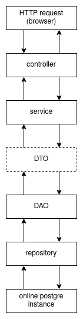

# Boccarusso.com Backend V3

This repo contains the code for the third version of the backend of my personal website.

## Why

The first version was done using PHP and through a heavy use of SSR it was very slow. This version rebuilds everything from scratch and is made of a frontend made in vanilla JavasScript that through the `controller.js` and `api.js` files mimics the a CSR behavior and of a backend wrote in Spring Boot that simply connects to the database to retrieve the data.

This new version uses a frontend done in Angular and a backend wrote back from scratch in Spring Boot.

## How

In the past writing a new post or modifying anything was a hassle possible only by interacting directly with the database. This new version uses Swagger to provide an UI and the actual post content is no more a text stored in the database but a link to the file stored inside a public github repo.

Now the backend is an actul REST API that permits more flexibility to the maintainance of the content. Every API request, with the exceptions of GET ones, are protected by username and password so that only the admin can modify any sensitive data.

The overall architecture of the project is divided into various layers that ease the development and flexibility of the overall code.

It receives an HTTP request which gets sorted by the relative controller which uses a service. Between the controller and the service there may or may not be a DTO object (usually used for the POST methods). The service performs some operations using the DAO to provide an additional layer to the JPA repositories which is the actual layer that executed any command to the online postgre database.
